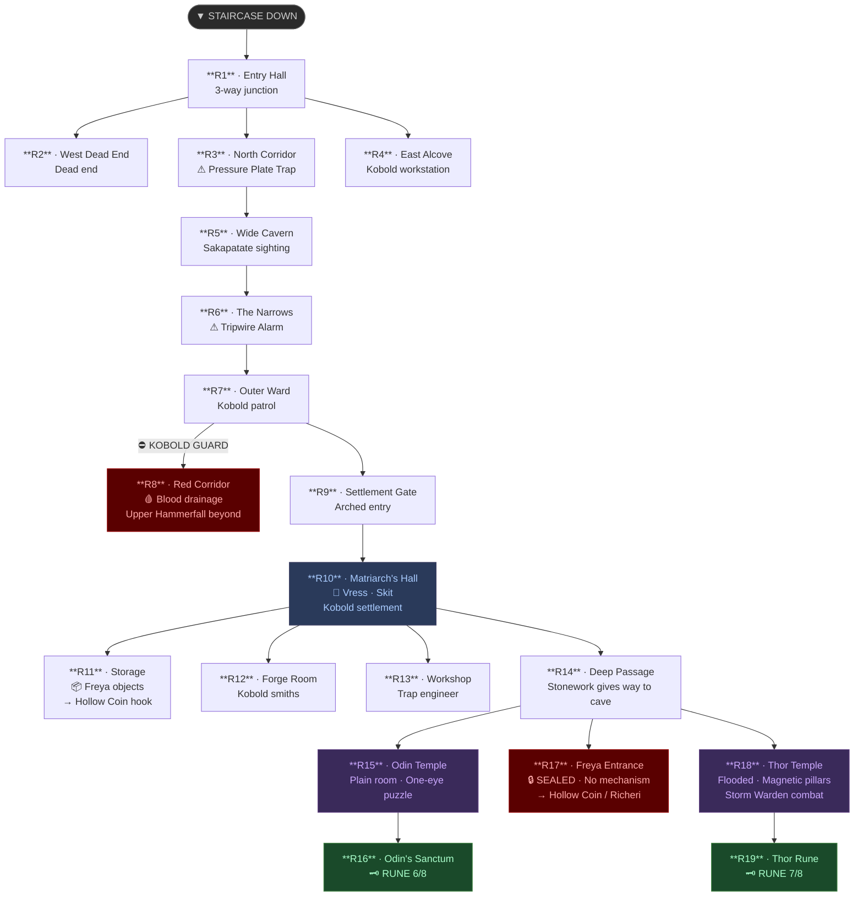

# Depth 4 — Dungeon Map

*Room reference map. For full room descriptions see [[depth-4]].*

---

## Quick Reference

| Key | Room | Status |
|-----|------|--------|
| R1 | Entry Hall | Junction |
| R2 | West Dead End | Dead end |
| R3 | North Corridor | ⚠ Trap |
| R4 | East Alcove / Workstation | Exploration |
| R5 | Wide Cavern | Sakapatate sighting |
| R6 | The Narrows | ⚠ Trap/alarm |
| R7 | Outer Ward | Kobold patrol |
| R8 | Red Corridor | ⛔ Kobold-sealed |
| R9 | Settlement Gate | Transition |
| R10 | Matriarch's Hall | 👑 Social hub |
| R11 | Storage | 📦 Freya hook items |
| R12 | Forge Room | RP |
| R13 | Workshop | RP |
| R14 | Deep Passage | Temple junction |
| R15 | Odin Temple | 🧩 Puzzle |
| R16 | Odin's Hidden Sanctum | 🗝 Rune 6/8 |
| R17 | Freya Entrance | 🔒 Sealed |
| R18 | Thor Temple | ⚔ Combat |
| R19 | Thor Rune | 🗝 Rune 7/8 |
